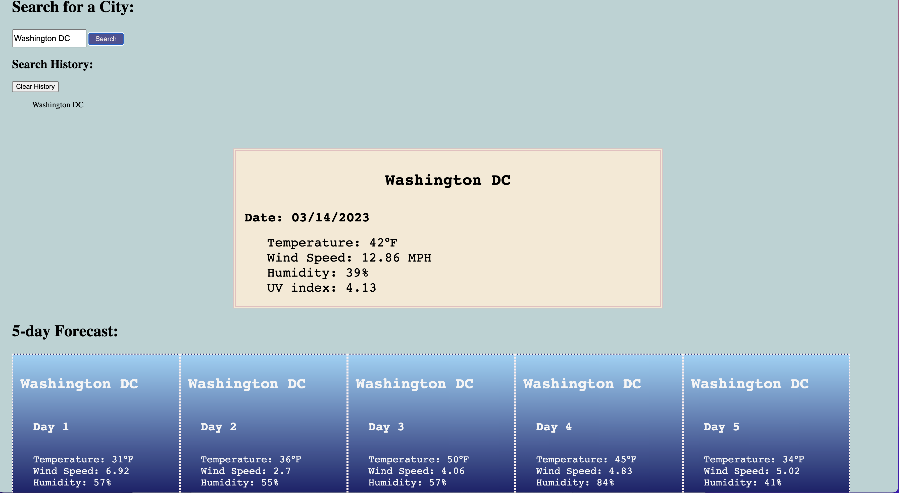

# **Weather Dashboard**
  
## **Description (Motivation? The why? Solved Problems?)**
      
  Weather Dashboard is a javacript application that uses data from a Weather API to display the current weather and five day forecast for the user's requested city.  After the user searches for a location anywhere in the world, the dashboard will return the temperature, uv index, windspeed, and humidity for the city.  It will also save recent searches in a search history section using local storage.
      
## **Table of Contents** 
      
  - [Usage](#usage)
  - [Tools](#tools)
  - [License](#license)
  - [Questions](#questions)
  - [Links](#links)
      

## **Usage ** 
    Screenshot of Weather Dashboard in use

  

## **Tools ** 

  Javascript, Weather API, local storage, HTML, CSS
  
## **License **
  Apache 2.0
          
## **Questions **
      
  Please feel free to reach me at gavinwentzel@gmail.com or view my github profile at "https://github.com/gwentzel26", 
  my username is gwentzel26

## **Links **
  Walkthrough Video or Deployed Application: "https://gwentzel26.github.io/WeatherDashboard/ "
  Github Repository: "https://github.com/gwentzel26/WeatherDashboard"
